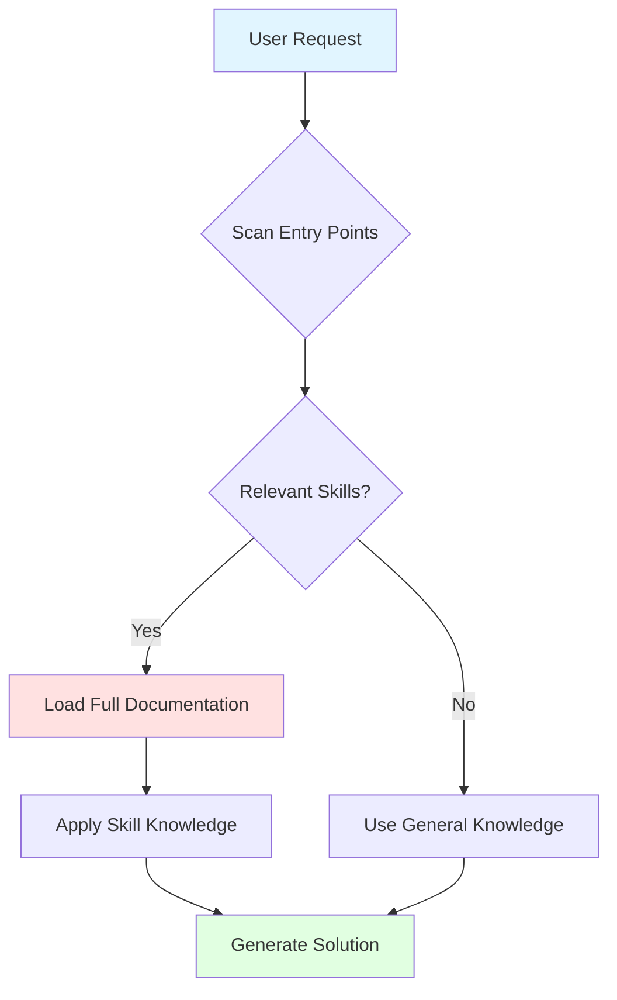

# Claude Code Skills User Guide

> Complete guide to using Claude Code skills for intelligent project development

## Table of Contents

1. [Understanding Skills](#understanding-skills)
2. [How Skills Work](#how-skills-work)
3. [Using Skills](#using-skills)
4. [Skill Categories](#skill-categories)
5. [Getting Started](#getting-started)
6. [Performance & Best Practices](#performance--best-practices)
7. [Examples & Scenarios](#examples--scenarios)
8. [Troubleshooting](#troubleshooting)
9. [Next Steps](#next-steps)

---

## Understanding Skills

### What are Claude Code Skills?

**Skills** are specialized knowledge modules that extend Claude Code's capabilities for specific programming tasks, frameworks, and workflows. Instead of Claude having generic knowledge about every technology, skills provide:

- **Deep, focused expertise** in specific areas (e.g., Next.js, pytest, React state management)
- **Current best practices** updated with 2025 techniques
- **Real-world examples** with complete, working code
- **Contextual guidance** that adapts to your project needs

Think of skills as expert consultants that Claude can call upon when needed—each with deep knowledge in their domain.

### Why Skills Matter

**Without Skills:**
```
User: "Help me set up FastAPI with async database connections"
Claude: *Generic Python web framework advice, may be outdated*
```

**With Skills:**
```
User: "Help me set up FastAPI with async database connections"
Claude: *Loads FastAPI + SQLAlchemy async skills*
        *Provides 2025 best practices, complete examples, error handling*
        *Includes connection pooling, migration patterns, testing setup*
```

### Key Benefits

1. **Always Current**: Skills are maintained with latest framework versions and patterns
2. **Token Efficient**: Only load what you need, when you need it (99.7% savings)
3. **Comprehensive**: Cover complete workflows, not just basic usage
4. **Production-Ready**: Include error handling, testing, deployment
5. **Interconnected**: Skills work together for full-stack workflows

---

## How Skills Work

### Progressive Disclosure Architecture

Skills use a **two-tier loading system** to maximize efficiency:

```
┌─────────────────────────────────────────────────────────┐
│ DISCOVERY PHASE (Tier 1: Entry Points)                 │
├─────────────────────────────────────────────────────────┤
│ All 82 skills loaded as compact summaries               │
│ • 60-95 tokens per skill                                │
│ • When to use                                           │
│ • Quick capability overview                             │
│ • Total: ~1,100 tokens                                  │
│                                                         │
│ Claude scans and identifies relevant skills             │
└─────────────────────────────────────────────────────────┘
                          ↓
┌─────────────────────────────────────────────────────────┐
│ USAGE PHASE (Tier 2: Full Documentation)               │
├─────────────────────────────────────────────────────────┤
│ Only selected skills expand to full content             │
│ • 3,000-6,000 tokens per skill                          │
│ • Complete examples (20-100 lines)                      │
│ • Best practices and patterns                           │
│ • Troubleshooting guides                                │
│                                                         │
│ Example: 3 skills × 4,500 tokens = 13,500 tokens        │
└─────────────────────────────────────────────────────────┘
```

### Token Efficiency Example

**Traditional Approach** (all documentation loaded):
- 82 skills × 4,500 tokens average = **369,000 tokens**
- Exceeds context window before you even start coding

**Progressive Disclosure Approach**:
- Discovery: 82 entry points × 13 tokens average = **1,100 tokens**
- Usage: 3 relevant skills × 4,500 tokens = **13,500 tokens**
- **Total: 14,600 tokens** (96% savings)

### The Skill Loading Process



**Step-by-Step:**

1. **User makes a request**: "Help me build a REST API with authentication"

2. **Claude scans entry points** (1,100 tokens loaded):
   - Sees FastAPI skill (async Python API framework)
   - Sees Pydantic skill (data validation)
   - Sees pytest skill (testing framework)

3. **Claude loads relevant skills** (full documentation):
   - FastAPI: 4,200 tokens (OAuth2 patterns, dependency injection, testing)
   - Pydantic: 3,800 tokens (validation, serialization, settings)
   - pytest: 4,100 tokens (fixtures, async testing, mocking)

4. **Claude generates solution** using deep skill knowledge:
   - Complete FastAPI app structure
   - OAuth2 with JWT implementation
   - Pydantic models with validation
   - pytest test suite with fixtures

---

## Using Skills

### How Claude Decides Which Skills to Use

Claude automatically determines which skills are relevant based on:

#### 1. **Explicit Technology Mentions**
```
"Build a Next.js app with Tailwind"
→ Loads: toolchains-nextjs-core, toolchains-ui-styling-tailwind
```

#### 2. **Task Context**
```
"Add unit tests to my React components"
→ Loads: toolchains-typescript-testing-vitest (or jest if detected)
```

#### 3. **Project Detection** (if using MPM auto-configure)
```
Detects: package.json with "next" and "prisma"
→ Auto-deploys: Next.js, Prisma, TypeScript core, React skills
```

#### 4. **Implicit Needs**
```
"Optimize my React app's performance"
→ Loads: React skill (memoization, profiling)
→ May also load: TanStack Query (data fetching), Zustand (state management)
```

### Understanding Skill Triggers

Each skill has a **when_to_use** section in its entry point that Claude evaluates:

**Example: FastAPI Skill Entry Point**
```yaml
---
name: toolchains-python-frameworks-fastapi
description: FastAPI - Modern async Python API framework
entry_point: |
  FastAPI skill provides:
  - Async API development with automatic OpenAPI/Swagger
  - Dependency injection and OAuth2 patterns
  - WebSocket and SSE support

  Use when:
  - Building REST APIs or WebSocket servers in Python
  - Need automatic API documentation
  - Working with async database operations
  - Implementing authentication/authorization

  Quick start: Define routes with type hints, FastAPI auto-generates docs
---
```

When you mention "REST API", "FastAPI", "async Python", or "authentication", Claude matches these patterns and loads the full skill.

### Manual Skill Invocation

While Claude automatically selects skills, you can explicitly request them:

```
"Use the FastAPI and Prisma skills to help me build an API"
```

This guarantees those skills are loaded, even if Claude might not have selected them automatically.

### Combining Multiple Skills

Skills are designed to work together seamlessly:

**Example: Full-Stack TypeScript Application**
```
Request: "Build a full-stack app with Next.js, Prisma, and tRPC"

Claude loads:
1. toolchains-nextjs-core (App Router, Server Components, Server Actions)
2. toolchains-typescript-data-prisma (ORM, migrations, relations)
3. toolchains-typescript-api-trpc (end-to-end type safety)
4. toolchains-typescript-core (advanced TypeScript patterns)

Result: Complete project setup with:
- Next.js 15 App Router structure
- Prisma schema with relations
- tRPC router with type-safe procedures
- TypeScript configuration optimized
```

---

## Skill Categories

Skills are organized into two main categories:

### Toolchains (50 Skills)

**Language/framework-specific skills** that provide deep expertise in specific technologies.

#### Python (11 Skills)
| Skill | Description | When to Use |
|-------|-------------|-------------|
| `django` | Full-featured web framework | Admin panels, rapid development, complex apps |
| `fastapi` | Modern async API framework | REST APIs, WebSockets, async operations |
| `flask` | Lightweight WSGI framework | Microservices, simple APIs, flexible architecture |
| `pytest` | Testing framework | Unit tests, fixtures, parametrization |
| `sqlalchemy` | ORM with 2.0 syntax | Database access, migrations, relations |
| `asyncio` | Async/await patterns | Concurrent I/O, parallel operations |
| `celery` | Distributed task queues | Background jobs, scheduled tasks |
| `mypy` | Static type checker | Type safety, refactoring support |
| `pyright` | Fast type checker | VS Code integration, strict typing |
| `pydantic` | Data validation | Input validation, settings management |

#### TypeScript (14 Skills)
| Skill | Description | When to Use |
|-------|-------------|-------------|
| `typescript-core` | Advanced TS patterns | Generics, mapped types, type system mastery |
| `react` (TS) | React with TypeScript | Component development, hooks, performance |
| `nodejs-backend` | Node.js server patterns | API servers, Express/Fastify, middleware |
| `vitest` | Modern testing framework | Vite projects, fast tests, TypeScript-first |
| `jest` | Industry standard testing | Mature projects, React Testing Library |
| `drizzle` | Type-safe SQL ORM | Lightweight ORM, zero runtime overhead |
| `kysely` | Type-safe query builder | Raw SQL with type safety, migrations |
| `prisma` | Schema-first ORM | Relations, migrations, Prisma Studio |
| `zod` | Schema validation | Input validation, type inference |
| `zustand` | Lightweight state | Simple global state, React integration |
| `tanstack-query` | Data fetching/caching | Server state, optimistic updates |
| `trpc` | End-to-end type safety | Full-stack TypeScript, type-safe APIs |
| `turborepo` | Monorepo build system | Multi-package repos, caching, pipelines |

#### JavaScript (7 Skills)
| Skill | Description | When to Use |
|-------|-------------|-------------|
| `react` (JS) | FlexLayout for React | IDE-like interfaces, draggable panels |
| `vue` | Vue 3 with Composition API | SPAs, progressive enhancement |
| `svelte` | Svelte 5 with Runes | Reactive UIs, minimal JS bundle |
| `sveltekit` | Full-stack Svelte | SSR/SSG, form actions, adapters |
| `playwright` | E2E testing | Browser automation, testing, scraping |
| `vite` | Next-gen build tool | Fast dev server, ESM-native |
| `biome` | Fast toolchain | Linter + formatter in one (100x faster) |

#### Next.js (2 Skills)
| Skill | Description | When to Use |
|-------|-------------|-------------|
| `nextjs-core` | App Router fundamentals | Server Components, Server Actions, caching |
| `nextjs-v16` | Next.js 16 features | Turbopack, Cache Components, async APIs |

#### UI (5 Skills)
| Skill | Description | When to Use |
|-------|-------------|-------------|
| `tailwind` | Utility-first CSS | Rapid styling, responsive design |
| `shadcn-ui` | Radix + Tailwind components | Accessible, customizable components |
| `daisyui` | Tailwind component library | Pre-built UI components |
| `headlessui` | Unstyled accessible components | Custom styling with accessibility |
| `radix-ui` | Unstyled UI primitives | Design system foundation |

#### AI (7 Skills)
| Skill | Description | When to Use |
|-------|-------------|-------------|
| `anthropic-sdk` | Claude API integration | Official SDK, streaming, tools |
| `langchain` | LLM orchestration framework | Multi-step workflows, agents, RAG |
| `dspy` | Programmatic prompting | Compiled prompts, optimizers |
| `langgraph` | State machine for agents | Complex agent workflows, cycles |
| `openrouter` | Unified LLM API | Multi-model access, fallbacks |
| `mcp` | Model Context Protocol | AI integrations, Claude Desktop extensions |
| `session-compression` | Context management | Long conversations, memory optimization |

#### Platforms (4 Skills)
| Skill | Description | When to Use |
|-------|-------------|-------------|
| `vercel` | Next.js deployment platform | Edge functions, preview deployments |
| `netlify` | JAMstack deployment | Static sites, serverless functions |
| `neon` | Serverless Postgres | Branching databases, auto-scaling |
| `supabase` | Firebase alternative | Auth, database, storage, real-time |

### Universal (32 Skills)

**Cross-cutting skills** that apply across languages and frameworks:

#### Architecture & Design
- `software-patterns` - Design patterns (DI, Repository, Circuit Breaker)
- `tdd` - Test-driven development methodology
- `debugging-systematic` - Debugging frameworks and strategies

#### Testing & Quality
- `testing-anti-patterns` - What NOT to do in tests
- `condition-based-waiting` - Replace timeouts with condition polling
- `verification-before-completion` - Verify before claiming success

#### Collaboration & Workflow
- `brainstorming` - Interactive idea refinement (Socratic method)
- `writing-plans` - Implementation plans for zero-context engineers
- `requesting-code-review` - Code review best practices
- `dispatching-parallel-agents` - Concurrent problem solving

#### Infrastructure
- `docker` - Containerization and orchestration
- `github-actions` - CI/CD workflows
- `graphql` - API design and implementation

#### Project Management
- Skills for creating artifacts, managing documentation, organizing work

---

## Getting Started

### Option 1: Automatic Deployment (Recommended)

The fastest way to get started is using the MPM auto-configure command:

**Step 1: Install Claude MPM** (if not already installed)
```bash
# Install globally
npm install -g @anthropic-ai/claude-mpm

# Or use in project
npm install --save-dev @anthropic-ai/claude-mpm
```

**Step 2: Auto-Configure Skills**
```bash
# In your project directory
/mpm-auto-configure
```

This command:
1. Scans your project for package.json, requirements.txt, etc.
2. Detects frameworks, languages, and tools in use
3. Automatically deploys relevant skills to `.skills/`
4. Creates `.mcp.json` configuration

**Example Output:**
```
Detected project type: Full-Stack TypeScript with Next.js
Found: Next.js 15, React 19, Prisma, TypeScript, Tailwind

Deploying skills:
✓ toolchains-nextjs-core
✓ toolchains-typescript-core
✓ toolchains-typescript-data-prisma
✓ toolchains-javascript-frameworks-react
✓ toolchains-ui-styling-tailwind
✓ universal-testing-vitest

Deployed 6 skills (entry points: 78 tokens, full: 27,400 tokens)
```

**Step 3: Start Using Skills**

Skills are now available. Just start a conversation:
```
"Help me build a user authentication system with Next.js and Prisma"
```

Claude will automatically use the deployed skills.

### Option 2: Manual Deployment

For more control over which skills are deployed:

**Step 1: Browse Available Skills**

Visit the repository or use the catalog:
```bash
/mpm-agents-list
```

**Step 2: Select Skills**

Choose skills based on your tech stack. For example, a Python API project:
```
- toolchains-python-frameworks-fastapi
- toolchains-python-data-sqlalchemy
- toolchains-python-testing-pytest
- toolchains-python-validation-pydantic
```

**Step 3: Copy to `.skills/` Directory**

```bash
# Create skills directory
mkdir -p .skills

# Copy selected skills (flat structure)
cp claude-mpm-skills/toolchains/python/frameworks/fastapi.md .skills/
cp claude-mpm-skills/toolchains/python/data/sqlalchemy.md .skills/
cp claude-mpm-skills/toolchains/python/testing/pytest.md .skills/
cp claude-mpm-skills/toolchains/python/validation/pydantic.md .skills/
```

**Important**: Use **flat directory structure** (all files directly in `.skills/`, no subdirectories).

**Step 4: Configure `.mcp.json`**

```json
{
  "mcpServers": {
    "filesystem": {
      "command": "npx",
      "args": ["-y", "@modelcontextprotocol/server-filesystem", ".skills"]
    }
  }
}
```

**Step 5: Verify Deployment**

Start Claude Code and check skills are available:
```
"List available skills in my project"
```

### Option 3: Bundle Deployment

For complete coverage, deploy entire skill bundles:

**Full TypeScript Stack:**
```bash
cp -r claude-mpm-skills/toolchains/typescript/*.md .skills/
cp -r claude-mpm-skills/toolchains/nextjs/*.md .skills/
cp -r claude-mpm-skills/toolchains/ui/styling/*.md .skills/
cp -r claude-mpm-skills/universal/testing/*.md .skills/
```

**Full Python Stack:**
```bash
cp -r claude-mpm-skills/toolchains/python/frameworks/*.md .skills/
cp -r claude-mpm-skills/toolchains/python/testing/*.md .skills/
cp -r claude-mpm-skills/toolchains/python/data/*.md .skills/
cp -r claude-mpm-skills/universal/architecture/*.md .skills/
```

### Flat Directory Structure Explained

Skills **must** be deployed in a flat directory:

**✅ Correct:**
```
.skills/
├── fastapi.md
├── sqlalchemy.md
├── pytest.md
└── pydantic.md
```

**❌ Incorrect:**
```
.skills/
└── python/
    ├── frameworks/
    │   └── fastapi.md
    └── data/
        └── sqlalchemy.md
```

**Why?** Claude Code's skill loader expects all skill files directly in the `.skills/` directory for efficient discovery.

---

## Performance & Best Practices

### Token Efficiency

Understanding token usage helps you work efficiently with skills:

#### Token Budget Breakdown

**Discovery Phase (Always Loaded):**
```
Entry Points:
- 82 skills × 13 tokens average = ~1,100 tokens
- Loaded every conversation
- Minimal impact on context window
```

**Usage Phase (On-Demand):**
```
Full Documentation (per skill):
- Small: 3,000-4,000 tokens (e.g., Biome, Headless UI)
- Medium: 4,000-5,000 tokens (most skills)
- Large: 5,000-6,000 tokens (comprehensive skills like Next.js, FastAPI)

Typical conversation:
- 2-4 skills loaded = 8,000-20,000 tokens
- Still leaves ~180,000 tokens for conversation (200k context window)
```

### Best Practices for Users

#### 1. **Be Specific About Technologies**

**✅ Good:**
```
"Build a FastAPI app with async Postgres using SQLAlchemy 2.0"
```
→ Loads exactly: FastAPI, SQLAlchemy, asyncio skills

**❌ Less Optimal:**
```
"Build a Python web app with a database"
```
→ Claude might guess Flask instead of FastAPI, or use generic knowledge

#### 2. **Mention Multiple Related Technologies**

```
"Create a Next.js app with Prisma and tRPC"
```
→ Loads all three skills together for integrated solution

#### 3. **Request Specific Patterns or Features**

```
"Show me FastAPI dependency injection with OAuth2"
```
→ Focuses on specific sections within the skill

#### 4. **Use Project Context**

If you've auto-configured, reference your setup:
```
"Based on my current Next.js + Prisma setup, add user authentication"
```
→ Claude knows exactly which skills are available

### Understanding Skill Performance

#### When Skills Are Loaded

**Automatically:**
- When you mention specific technologies
- When Claude detects relevant patterns in your request
- When project detection identifies frameworks

**Manually:**
- When you explicitly request a skill: "Use the FastAPI skill"
- When you reference skill content: "Following FastAPI best practices..."

#### When Skills Are NOT Loaded

- For general programming questions
- For technologies without deployed skills
- When generic knowledge suffices

**Example:**
```
"What's the difference between async and sync?"
→ General knowledge (no skill needed)

"Show me FastAPI async route patterns"
→ Loads FastAPI skill (specific implementation)
```

### Optimizing Skill Usage

#### Progressive Detail Requests

Start broad, then drill down:

**Request 1:**
```
"Give me an overview of building a FastAPI app"
→ Claude loads FastAPI skill, provides architecture overview
```

**Request 2:**
```
"Show me the OAuth2 implementation with dependency injection"
→ Claude references already-loaded skill, provides detailed example
```

**Request 3:**
```
"Add pytest tests for those endpoints"
→ Loads pytest skill, integrates with FastAPI knowledge
```

#### Skill Combinations

Some skills naturally work together:

**Web Application Stack:**
```
FastAPI + SQLAlchemy + Pydantic + pytest
→ Complete API with database, validation, tests
```

**Frontend Stack:**
```
Next.js + React + Tailwind + shadcn/ui
→ Complete UI with components and styling
```

**Full-Stack TypeScript:**
```
Next.js + Prisma + tRPC + Zod + Vitest
→ End-to-end type-safe application
```

### Token Management Tips

#### For Long Conversations

If you're in a long conversation and hitting token limits:

**1. Start a New Thread**
```
"Let's start fresh. Using my existing Next.js + Prisma setup,
 let's now add authentication..."
```
→ Reloads only necessary skills in new context

**2. Be Explicit About What to Keep**
```
"Keeping the database schema we just created, now let's add the API layer"
```
→ Claude focuses on relevant parts

**3. Request Summaries**
```
"Summarize what we've built so far before we continue"
```
→ Consolidates context before adding more skills

#### For Complex Multi-Skill Tasks

Break tasks into phases:

**Phase 1: Backend**
```
"Set up FastAPI with SQLAlchemy and authentication"
→ Loads: FastAPI, SQLAlchemy, Pydantic skills
```

**Phase 2: Testing** (optional: new thread)
```
"Add comprehensive pytest tests for the API we built"
→ Loads: pytest skill, references previous work
```

**Phase 3: Frontend** (optional: new thread)
```
"Build a Next.js frontend that consumes this API"
→ Loads: Next.js, React, TanStack Query skills
```

---

## Examples & Scenarios

### Scenario 1: Building a REST API (Python)

**User Request:**
```
"I need to build a REST API for a task management system with user authentication.
 Using FastAPI and PostgreSQL."
```

**Claude's Process:**

1. **Scans Entry Points** (1,100 tokens):
   - Identifies: FastAPI (async API framework)
   - Identifies: SQLAlchemy (PostgreSQL ORM)
   - Identifies: Pydantic (data validation)
   - Identifies: pytest (testing)

2. **Loads Skills** (~16,500 tokens):
   - `toolchains-python-frameworks-fastapi` (4,200 tokens)
   - `toolchains-python-data-sqlalchemy` (4,300 tokens)
   - `toolchains-python-validation-pydantic` (3,800 tokens)
   - `toolchains-python-testing-pytest` (4,100 tokens)

3. **Generates Solution**:

```python
# Project Structure
project/
├── app/
│   ├── __init__.py
│   ├── main.py              # FastAPI app
│   ├── models.py            # SQLAlchemy models
│   ├── schemas.py           # Pydantic schemas
│   ├── database.py          # Database connection
│   ├── auth.py              # Authentication
│   └── routers/
│       ├── __init__.py
│       ├── tasks.py         # Task endpoints
│       └── users.py         # User endpoints
├── tests/
│   ├── conftest.py          # pytest fixtures
│   ├── test_tasks.py
│   └── test_users.py
├── alembic/                 # Database migrations
└── requirements.txt

# app/models.py - SQLAlchemy Models
from sqlalchemy import Column, Integer, String, ForeignKey, Boolean
from sqlalchemy.orm import relationship
from .database import Base

class User(Base):
    __tablename__ = "users"

    id = Column(Integer, primary_key=True, index=True)
    email = Column(String, unique=True, index=True, nullable=False)
    hashed_password = Column(String, nullable=False)
    is_active = Column(Boolean, default=True)

    tasks = relationship("Task", back_populates="owner")

class Task(Base):
    __tablename__ = "tasks"

    id = Column(Integer, primary_key=True, index=True)
    title = Column(String, nullable=False)
    description = Column(String)
    completed = Column(Boolean, default=False)
    owner_id = Column(Integer, ForeignKey("users.id"))

    owner = relationship("User", back_populates="tasks")

# app/schemas.py - Pydantic Schemas
from pydantic import BaseModel, EmailStr

class TaskBase(BaseModel):
    title: str
    description: str | None = None
    completed: bool = False

class TaskCreate(TaskBase):
    pass

class Task(TaskBase):
    id: int
    owner_id: int

    class Config:
        from_attributes = True

class UserBase(BaseModel):
    email: EmailStr

class UserCreate(UserBase):
    password: str

class User(UserBase):
    id: int
    is_active: bool
    tasks: list[Task] = []

    class Config:
        from_attributes = True

# app/main.py - FastAPI Application
from fastapi import FastAPI, Depends, HTTPException
from sqlalchemy.orm import Session
from . import models, schemas
from .database import engine, get_db
from .auth import get_current_user

models.Base.metadata.create_all(bind=engine)

app = FastAPI(title="Task Management API")

@app.post("/tasks/", response_model=schemas.Task)
def create_task(
    task: schemas.TaskCreate,
    db: Session = Depends(get_db),
    current_user: models.User = Depends(get_current_user)
):
    db_task = models.Task(**task.model_dump(), owner_id=current_user.id)
    db.add(db_task)
    db.commit()
    db.refresh(db_task)
    return db_task

@app.get("/tasks/", response_model=list[schemas.Task])
def read_tasks(
    skip: int = 0,
    limit: int = 100,
    db: Session = Depends(get_db),
    current_user: models.User = Depends(get_current_user)
):
    tasks = db.query(models.Task).filter(
        models.Task.owner_id == current_user.id
    ).offset(skip).limit(limit).all()
    return tasks

# tests/test_tasks.py - pytest Tests
import pytest
from fastapi.testclient import TestClient
from app.main import app
from app.database import Base, get_db
from sqlalchemy import create_engine
from sqlalchemy.orm import sessionmaker

SQLALCHEMY_DATABASE_URL = "sqlite:///./test.db"
engine = create_engine(SQLALCHEMY_DATABASE_URL)
TestingSessionLocal = sessionmaker(bind=engine)

@pytest.fixture
def db():
    Base.metadata.create_all(bind=engine)
    db = TestingSessionLocal()
    try:
        yield db
    finally:
        db.close()
        Base.metadata.drop_all(bind=engine)

@pytest.fixture
def client(db):
    def override_get_db():
        try:
            yield db
        finally:
            db.close()

    app.dependency_overrides[get_db] = override_get_db
    return TestClient(app)

def test_create_task(client, auth_headers):
    response = client.post(
        "/tasks/",
        json={"title": "Test Task", "description": "Test Description"},
        headers=auth_headers
    )
    assert response.status_code == 200
    assert response.json()["title"] == "Test Task"
```

**Skills Applied:**
- **FastAPI**: Dependency injection, automatic validation, async patterns
- **SQLAlchemy**: Models, relationships, session management
- **Pydantic**: Schema validation, serialization
- **pytest**: Fixtures, test database setup, TestClient

### Scenario 2: Next.js Full-Stack Application

**User Request:**
```
"Create a blog platform with Next.js 15, Prisma, and tRPC.
 Users can create, edit, and publish posts."
```

**Claude's Process:**

1. **Identifies Technologies**:
   - Next.js 15 (App Router)
   - Prisma (database ORM)
   - tRPC (type-safe API)
   - TypeScript (implicit)

2. **Loads Skills** (~18,200 tokens):
   - `toolchains-nextjs-core` (4,500 tokens)
   - `toolchains-typescript-core` (4,200 tokens)
   - `toolchains-typescript-data-prisma` (4,800 tokens)
   - `toolchains-typescript-api-trpc` (4,700 tokens)

3. **Generates Solution**:

```typescript
// Project Structure
blog-platform/
├── app/                      # Next.js App Router
│   ├── layout.tsx
│   ├── page.tsx
│   ├── posts/
│   │   ├── [slug]/
│   │   │   └── page.tsx
│   │   └── new/
│   │       └── page.tsx
│   └── api/
│       └── trpc/
│           └── [trpc]/
│               └── route.ts
├── server/
│   ├── trpc.ts              # tRPC setup
│   ├── routers/
│   │   ├── _app.ts
│   │   └── post.ts
│   └── context.ts
├── prisma/
│   ├── schema.prisma
│   └── migrations/
└── lib/
    └── trpc-client.ts

// prisma/schema.prisma - Database Schema
generator client {
  provider = "prisma-client-js"
}

datasource db {
  provider = "postgresql"
  url      = env("DATABASE_URL")
}

model User {
  id        String   @id @default(cuid())
  email     String   @unique
  name      String?
  posts     Post[]
  createdAt DateTime @default(now())
}

model Post {
  id          String   @id @default(cuid())
  title       String
  slug        String   @unique
  content     String
  published   Boolean  @default(false)
  author      User     @relation(fields: [authorId], references: [id])
  authorId    String
  createdAt   DateTime @default(now())
  updatedAt   DateTime @updatedAt

  @@index([authorId])
  @@index([slug])
}

// server/trpc.ts - tRPC Setup
import { initTRPC } from '@trpc/server';
import { Context } from './context';

const t = initTRPC.context<Context>().create();

export const router = t.router;
export const publicProcedure = t.procedure;

// server/routers/post.ts - Post Router
import { z } from 'zod';
import { router, publicProcedure } from '../trpc';
import { prisma } from '@/lib/prisma';

export const postRouter = router({
  list: publicProcedure
    .input(
      z.object({
        published: z.boolean().optional(),
        limit: z.number().min(1).max(100).default(10),
      })
    )
    .query(async ({ input }) => {
      return await prisma.post.findMany({
        where: { published: input.published },
        take: input.limit,
        include: { author: true },
        orderBy: { createdAt: 'desc' },
      });
    }),

  bySlug: publicProcedure
    .input(z.object({ slug: z.string() }))
    .query(async ({ input }) => {
      const post = await prisma.post.findUnique({
        where: { slug: input.slug },
        include: { author: true },
      });

      if (!post) {
        throw new Error('Post not found');
      }

      return post;
    }),

  create: publicProcedure
    .input(
      z.object({
        title: z.string().min(1),
        slug: z.string().min(1),
        content: z.string().min(1),
        authorId: z.string(),
      })
    )
    .mutation(async ({ input }) => {
      return await prisma.post.create({
        data: input,
      });
    }),

  update: publicProcedure
    .input(
      z.object({
        id: z.string(),
        title: z.string().optional(),
        content: z.string().optional(),
        published: z.boolean().optional(),
      })
    )
    .mutation(async ({ input }) => {
      const { id, ...data } = input;
      return await prisma.post.update({
        where: { id },
        data,
      });
    }),

  delete: publicProcedure
    .input(z.object({ id: z.string() }))
    .mutation(async ({ input }) => {
      return await prisma.post.delete({
        where: { id: input.id },
      });
    }),
});

// app/page.tsx - Home Page (Server Component)
import { trpcServer } from '@/lib/trpc-server';
import Link from 'next/link';

export default async function HomePage() {
  const posts = await trpcServer.post.list({ published: true, limit: 10 });

  return (
    <div className="max-w-4xl mx-auto p-8">
      <h1 className="text-4xl font-bold mb-8">Blog Posts</h1>

      <div className="space-y-6">
        {posts.map((post) => (
          <article key={post.id} className="border-b pb-6">
            <Link href={`/posts/${post.slug}`}>
              <h2 className="text-2xl font-semibold hover:text-blue-600">
                {post.title}
              </h2>
            </Link>
            <p className="text-gray-600 mt-2">
              By {post.author.name} • {new Date(post.createdAt).toLocaleDateString()}
            </p>
          </article>
        ))}
      </div>
    </div>
  );
}

// app/posts/new/page.tsx - Create Post (Client Component)
'use client';

import { useState } from 'react';
import { trpc } from '@/lib/trpc-client';
import { useRouter } from 'next/navigation';

export default function NewPostPage() {
  const router = useRouter();
  const [title, setTitle] = useState('');
  const [content, setContent] = useState('');

  const createPost = trpc.post.create.useMutation({
    onSuccess: (data) => {
      router.push(`/posts/${data.slug}`);
    },
  });

  const handleSubmit = (e: React.FormEvent) => {
    e.preventDefault();

    const slug = title.toLowerCase().replace(/\s+/g, '-');

    createPost.mutate({
      title,
      slug,
      content,
      authorId: 'user-id', // From auth context
    });
  };

  return (
    <div className="max-w-4xl mx-auto p-8">
      <h1 className="text-4xl font-bold mb-8">Create New Post</h1>

      <form onSubmit={handleSubmit} className="space-y-6">
        <div>
          <label className="block text-sm font-medium mb-2">Title</label>
          <input
            type="text"
            value={title}
            onChange={(e) => setTitle(e.target.value)}
            className="w-full px-4 py-2 border rounded-lg"
            required
          />
        </div>

        <div>
          <label className="block text-sm font-medium mb-2">Content</label>
          <textarea
            value={content}
            onChange={(e) => setContent(e.target.value)}
            className="w-full px-4 py-2 border rounded-lg h-64"
            required
          />
        </div>

        <button
          type="submit"
          disabled={createPost.isPending}
          className="px-6 py-2 bg-blue-600 text-white rounded-lg"
        >
          {createPost.isPending ? 'Creating...' : 'Create Post'}
        </button>
      </form>
    </div>
  );
}
```

**Skills Applied:**
- **Next.js Core**: App Router, Server Components, client components, routing
- **Prisma**: Schema design, relations, migrations, querying
- **tRPC**: Type-safe procedures, input validation with Zod, React hooks
- **TypeScript Core**: Type inference, generic types, utility types

### Scenario 3: React Performance Optimization

**User Request:**
```
"My React dashboard is slow. It has a large data table and multiple filters.
 Help me optimize it."
```

**Claude's Process:**

1. **Identifies Need**: React performance optimization
2. **Loads Skills** (~13,600 tokens):
   - `toolchains-javascript-frameworks-react` (4,500 tokens)
   - `toolchains-typescript-state-zustand` (4,200 tokens)
   - `toolchains-typescript-state-tanstack-query` (4,900 tokens)

3. **Provides Optimization Strategy**:

```typescript
// Before: Unoptimized Component
function Dashboard() {
  const [data, setData] = useState([]);
  const [filters, setFilters] = useState({ status: '', priority: '' });

  useEffect(() => {
    fetch('/api/tasks')
      .then(res => res.json())
      .then(setData);
  }, []);

  const filteredData = data.filter(item => {
    return (!filters.status || item.status === filters.status) &&
           (!filters.priority || item.priority === filters.priority);
  });

  return (
    <div>
      <Filters filters={filters} setFilters={setFilters} />
      <DataTable data={filteredData} />
    </div>
  );
}

// After: Optimized with React Skill Patterns + Zustand + TanStack Query

// store/dashboard.ts - Zustand Store
import { create } from 'zustand';

interface DashboardState {
  filters: {
    status: string;
    priority: string;
  };
  setFilter: (key: string, value: string) => void;
  resetFilters: () => void;
}

export const useDashboardStore = create<DashboardState>((set) => ({
  filters: { status: '', priority: '' },
  setFilter: (key, value) =>
    set((state) => ({
      filters: { ...state.filters, [key]: value },
    })),
  resetFilters: () => set({ filters: { status: '', priority: '' } }),
}));

// hooks/useTasks.ts - TanStack Query Hook
import { useQuery } from '@tanstack/react-query';
import { useDashboardStore } from '@/store/dashboard';

export function useTasks() {
  const filters = useDashboardStore((state) => state.filters);

  return useQuery({
    queryKey: ['tasks', filters],
    queryFn: async () => {
      const params = new URLSearchParams();
      if (filters.status) params.set('status', filters.status);
      if (filters.priority) params.set('priority', filters.priority);

      const res = await fetch(`/api/tasks?${params}`);
      return res.json();
    },
    staleTime: 5 * 60 * 1000, // Cache for 5 minutes
  });
}

// components/Filters.tsx - Memoized Filter Component
import { memo } from 'react';
import { useDashboardStore } from '@/store/dashboard';

export const Filters = memo(function Filters() {
  const { filters, setFilter, resetFilters } = useDashboardStore();

  return (
    <div className="flex gap-4 mb-6">
      <select
        value={filters.status}
        onChange={(e) => setFilter('status', e.target.value)}
        className="px-4 py-2 border rounded"
      >
        <option value="">All Statuses</option>
        <option value="open">Open</option>
        <option value="in_progress">In Progress</option>
        <option value="done">Done</option>
      </select>

      <select
        value={filters.priority}
        onChange={(e) => setFilter('priority', e.target.value)}
        className="px-4 py-2 border rounded"
      >
        <option value="">All Priorities</option>
        <option value="low">Low</option>
        <option value="medium">Medium</option>
        <option value="high">High</option>
      </select>

      <button onClick={resetFilters} className="px-4 py-2 bg-gray-200 rounded">
        Reset
      </button>
    </div>
  );
});

// components/DataTable.tsx - Virtualized Table
import { memo, useMemo } from 'react';
import { useVirtual } from 'react-virtual';

interface DataTableProps {
  data: Task[];
}

export const DataTable = memo(function DataTable({ data }: DataTableProps) {
  const parentRef = useRef<HTMLDivElement>(null);

  const rowVirtualizer = useVirtual({
    size: data.length,
    parentRef,
    estimateSize: () => 50, // Row height
    overscan: 5,
  });

  return (
    <div ref={parentRef} className="h-[600px] overflow-auto">
      <div
        style={{
          height: `${rowVirtualizer.totalSize}px`,
          position: 'relative',
        }}
      >
        {rowVirtualizer.virtualItems.map((virtualRow) => {
          const task = data[virtualRow.index];
          return (
            <DataRow
              key={task.id}
              task={task}
              style={{
                position: 'absolute',
                top: 0,
                left: 0,
                width: '100%',
                height: `${virtualRow.size}px`,
                transform: `translateY(${virtualRow.start}px)`,
              }}
            />
          );
        })}
      </div>
    </div>
  );
});

// components/DataRow.tsx - Memoized Row
const DataRow = memo(function DataRow({
  task,
  style
}: {
  task: Task;
  style: React.CSSProperties
}) {
  return (
    <div style={style} className="flex border-b px-4 items-center">
      <span className="flex-1">{task.title}</span>
      <span className="w-32">{task.status}</span>
      <span className="w-32">{task.priority}</span>
    </div>
  );
});

// components/Dashboard.tsx - Optimized Dashboard
export function Dashboard() {
  const { data, isLoading, error } = useTasks();

  if (isLoading) return <div>Loading...</div>;
  if (error) return <div>Error: {error.message}</div>;

  return (
    <div className="p-8">
      <h1 className="text-3xl font-bold mb-6">Dashboard</h1>
      <Filters />
      <DataTable data={data} />
    </div>
  );
}
```

**Optimizations Applied:**
1. **React Skill**: `memo()` for component memoization, virtual scrolling
2. **Zustand**: Global filter state without prop drilling
3. **TanStack Query**: Data caching, automatic refetching, loading states

**Performance Improvements:**
- **Before**: Re-renders entire component tree on every filter change
- **After**: Only affected components re-render, virtualized rendering for large lists

### Scenario 4: Adding Tests to Existing Code

**User Request:**
```
"I have a FastAPI app. Need to add comprehensive tests for the user endpoints."
```

**Claude's Process:**

1. **Identifies Testing Need**: FastAPI testing
2. **Loads Skills** (~8,300 tokens):
   - `toolchains-python-testing-pytest` (4,100 tokens)
   - `toolchains-python-frameworks-fastapi` (4,200 tokens)

3. **Generates Test Suite**:

```python
# tests/conftest.py - pytest Fixtures
import pytest
from fastapi.testclient import TestClient
from sqlalchemy import create_engine
from sqlalchemy.orm import sessionmaker
from app.main import app
from app.database import Base, get_db
from app.auth import create_access_token

# Test database
SQLALCHEMY_DATABASE_URL = "sqlite:///./test.db"
engine = create_engine(SQLALCHEMY_DATABASE_URL, connect_args={"check_same_thread": False})
TestingSessionLocal = sessionmaker(autocommit=False, autoflush=False, bind=engine)

@pytest.fixture(scope="function")
def db():
    """Create test database for each test."""
    Base.metadata.create_all(bind=engine)
    db = TestingSessionLocal()
    try:
        yield db
    finally:
        db.close()
        Base.metadata.drop_all(bind=engine)

@pytest.fixture(scope="function")
def client(db):
    """FastAPI TestClient with test database."""
    def override_get_db():
        try:
            yield db
        finally:
            db.close()

    app.dependency_overrides[get_db] = override_get_db
    client = TestClient(app)
    yield client
    app.dependency_overrides.clear()

@pytest.fixture
def test_user(db):
    """Create a test user."""
    from app.models import User
    from app.auth import get_password_hash

    user = User(
        email="test@example.com",
        hashed_password=get_password_hash("testpass123"),
        is_active=True
    )
    db.add(user)
    db.commit()
    db.refresh(user)
    return user

@pytest.fixture
def auth_headers(test_user):
    """Generate authentication headers."""
    access_token = create_access_token(data={"sub": test_user.email})
    return {"Authorization": f"Bearer {access_token}"}

# tests/test_users.py - User Endpoint Tests
import pytest
from fastapi import status

class TestUserRegistration:
    """Test user registration endpoint."""

    def test_register_user_success(self, client):
        """Test successful user registration."""
        response = client.post(
            "/users/register",
            json={
                "email": "newuser@example.com",
                "password": "securepass123"
            }
        )
        assert response.status_code == status.HTTP_201_CREATED
        data = response.json()
        assert data["email"] == "newuser@example.com"
        assert "id" in data
        assert "password" not in data

    def test_register_duplicate_email(self, client, test_user):
        """Test registration with existing email fails."""
        response = client.post(
            "/users/register",
            json={
                "email": test_user.email,
                "password": "anotherpass123"
            }
        )
        assert response.status_code == status.HTTP_400_BAD_REQUEST
        assert "already registered" in response.json()["detail"].lower()

    @pytest.mark.parametrize("email,password,expected_error", [
        ("invalid-email", "pass123", "email"),
        ("test@example.com", "short", "password"),
        ("", "pass123", "email"),
        ("test@example.com", "", "password"),
    ])
    def test_register_invalid_data(self, client, email, password, expected_error):
        """Test registration with invalid data."""
        response = client.post(
            "/users/register",
            json={"email": email, "password": password}
        )
        assert response.status_code == status.HTTP_422_UNPROCESSABLE_ENTITY
        assert expected_error in str(response.json())

class TestUserAuthentication:
    """Test user authentication endpoints."""

    def test_login_success(self, client, test_user):
        """Test successful login."""
        response = client.post(
            "/users/login",
            data={
                "username": test_user.email,
                "password": "testpass123"
            }
        )
        assert response.status_code == status.HTTP_200_OK
        data = response.json()
        assert "access_token" in data
        assert data["token_type"] == "bearer"

    def test_login_wrong_password(self, client, test_user):
        """Test login with incorrect password."""
        response = client.post(
            "/users/login",
            data={
                "username": test_user.email,
                "password": "wrongpassword"
            }
        )
        assert response.status_code == status.HTTP_401_UNAUTHORIZED

    def test_login_nonexistent_user(self, client):
        """Test login with non-existent user."""
        response = client.post(
            "/users/login",
            data={
                "username": "nonexistent@example.com",
                "password": "somepassword"
            }
        )
        assert response.status_code == status.HTTP_401_UNAUTHORIZED

class TestUserProfile:
    """Test user profile endpoints."""

    def test_get_current_user(self, client, test_user, auth_headers):
        """Test getting current user profile."""
        response = client.get("/users/me", headers=auth_headers)
        assert response.status_code == status.HTTP_200_OK
        data = response.json()
        assert data["email"] == test_user.email
        assert data["id"] == test_user.id

    def test_get_current_user_unauthorized(self, client):
        """Test accessing profile without authentication."""
        response = client.get("/users/me")
        assert response.status_code == status.HTTP_401_UNAUTHORIZED

    def test_get_current_user_invalid_token(self, client):
        """Test accessing profile with invalid token."""
        response = client.get(
            "/users/me",
            headers={"Authorization": "Bearer invalid-token"}
        )
        assert response.status_code == status.HTTP_401_UNAUTHORIZED

    def test_update_user_profile(self, client, test_user, auth_headers):
        """Test updating user profile."""
        response = client.patch(
            "/users/me",
            headers=auth_headers,
            json={"email": "updated@example.com"}
        )
        assert response.status_code == status.HTTP_200_OK
        data = response.json()
        assert data["email"] == "updated@example.com"

class TestUserManagement:
    """Test user management endpoints (admin)."""

    @pytest.fixture
    def admin_user(self, db):
        """Create an admin user."""
        from app.models import User
        from app.auth import get_password_hash

        user = User(
            email="admin@example.com",
            hashed_password=get_password_hash("adminpass123"),
            is_active=True,
            is_superuser=True
        )
        db.add(user)
        db.commit()
        db.refresh(user)
        return user

    @pytest.fixture
    def admin_headers(self, admin_user):
        """Generate admin authentication headers."""
        access_token = create_access_token(data={"sub": admin_user.email})
        return {"Authorization": f"Bearer {access_token}"}

    def test_list_users_as_admin(self, client, admin_headers, test_user):
        """Test listing users as admin."""
        response = client.get("/users/", headers=admin_headers)
        assert response.status_code == status.HTTP_200_OK
        users = response.json()
        assert len(users) >= 1
        assert any(user["email"] == test_user.email for user in users)

    def test_list_users_as_regular_user(self, client, auth_headers):
        """Test listing users as regular user fails."""
        response = client.get("/users/", headers=auth_headers)
        assert response.status_code == status.HTTP_403_FORBIDDEN

    def test_delete_user_as_admin(self, client, admin_headers, test_user):
        """Test deleting user as admin."""
        response = client.delete(
            f"/users/{test_user.id}",
            headers=admin_headers
        )
        assert response.status_code == status.HTTP_204_NO_CONTENT

    def test_delete_user_as_regular_user(self, client, auth_headers, test_user):
        """Test deleting user as regular user fails."""
        response = client.delete(
            f"/users/{test_user.id}",
            headers=auth_headers
        )
        assert response.status_code == status.HTTP_403_FORBIDDEN

# Run tests:
# pytest tests/test_users.py -v
# pytest tests/test_users.py::TestUserRegistration -v
# pytest tests/ --cov=app --cov-report=html
```

**Skills Applied:**
- **pytest**: Fixtures, parametrization, test organization with classes
- **FastAPI**: TestClient, dependency overrides, authentication testing

---

## Troubleshooting

### Skill Not Appearing in Catalog

**Symptom**: Claude doesn't seem to have access to a skill you deployed.

**Possible Causes:**

1. **Incorrect Directory Structure**
   ```bash
   # Check .skills/ directory
   ls -la .skills/

   # ✅ Should show: fastapi.md, sqlalchemy.md, etc.
   # ❌ Should NOT show subdirectories: python/, typescript/, etc.
   ```

   **Solution**: Flatten directory structure
   ```bash
   # Move files to root of .skills/
   mv .skills/python/frameworks/fastapi.md .skills/
   rm -rf .skills/python/  # Remove subdirectories
   ```

2. **Missing `.mcp.json` Configuration**
   ```bash
   # Check if .mcp.json exists
   cat .mcp.json
   ```

   **Solution**: Create configuration
   ```json
   {
     "mcpServers": {
       "filesystem": {
         "command": "npx",
         "args": ["-y", "@modelcontextprotocol/server-filesystem", ".skills"]
       }
     }
   }
   ```

3. **Skill File Name Issues**
   ```bash
   # Check for correct naming
   ls .skills/*.md
   ```

   Skills must be `.md` files. Rename if necessary:
   ```bash
   mv .skills/fastapi.txt .skills/fastapi.md
   ```

**Verification**:
```
Ask Claude: "What skills do you have access to?"
```

### Skill Not Expanding to Full Documentation

**Symptom**: Claude mentions a skill but doesn't use detailed knowledge from it.

**Possible Causes:**

1. **Entry Point Not Triggering**

   The entry point description didn't match your request.

   **Solution**: Be more explicit
   ```
   # Instead of:
   "Help me build an API"

   # Try:
   "Use the FastAPI skill to help me build a REST API"
   ```

2. **Progressive Disclosure Not Working**

   Check the skill file has proper YAML frontmatter:
   ```markdown
   ---
   name: toolchains-python-frameworks-fastapi
   description: FastAPI - Modern async Python API framework
   entry_point: |
     [Entry point content]
   ---

   # Full documentation starts here
   ```

3. **Token Budget Constraints**

   If you're in a long conversation, Claude might conserve tokens.

   **Solution**: Start a fresh thread
   ```
   "Let's start a new conversation. I need help building a FastAPI app with..."
   ```

**Verification**:
```
Ask Claude: "Show me what you know about FastAPI best practices"
```
If Claude provides detailed, specific advice (not generic), the skill is loaded.

### Token Limit Exceeded

**Symptom**: "Context window exceeded" or Claude stops mid-response.

**Causes:**

1. **Too Many Skills Loaded at Once**

   Loading 10+ skills = 40,000+ tokens before you even start.

2. **Very Long Conversation**

   Conversation history + skills + new content exceeds 200k tokens.

**Solutions:**

1. **Start a New Thread**
   ```
   Begin new conversation with summary of what you need
   ```

2. **Be More Specific**
   ```
   # Instead of:
   "Help me build a complete full-stack application"

   # Try phases:
   Phase 1: "Set up FastAPI backend with authentication"
   Phase 2 (new thread): "Build Next.js frontend for the API"
   ```

3. **Request Specific Skill Sections**
   ```
   "Show me just the FastAPI dependency injection pattern"
   ```

### Skill Conflicts

**Symptom**: Claude seems confused about which framework or pattern to use.

**Example:**
```
You have both: pytest.md and jest.md
Request: "Add tests to my project"
→ Claude might mix Python and JavaScript testing patterns
```

**Solution**: Be explicit about language/framework
```
"Add pytest tests to my FastAPI endpoints"
```

**Prevention**: Deploy only relevant skills
- For Python project: Deploy only Python skills
- For TypeScript project: Deploy only TypeScript/JavaScript skills

### Performance Issues

**Symptom**: Claude is slow to respond or times out.

**Causes:**

1. **Too Many Skills Deployed**

   Even entry points add up. 200+ skills = 3,000+ tokens just for discovery.

2. **Very Large Skill Files**

   If skills are >10,000 tokens each, loading becomes slow.

**Solutions:**

1. **Deploy Selectively**
   ```bash
   # Instead of copying entire repository:
   # Deploy only what you need
   cp fastapi.md .skills/
   cp sqlalchemy.md .skills/
   cp pytest.md .skills/
   ```

2. **Use Bundles for Project Types**
   ```bash
   # Create project-specific bundle
   mkdir -p .skills/
   cp {fastapi,sqlalchemy,pydantic,pytest}.md .skills/
   ```

3. **Check Skill File Sizes**
   ```bash
   ls -lh .skills/

   # Skills should be 15-30 KB (3,000-6,000 tokens)
   # If larger, file might be corrupted or have excessive examples
   ```

### Updating Skills

**Symptom**: You want to update to the latest version of skills.

**Process:**

1. **Check Current Version**
   ```bash
   # Skills often have version info in metadata.json
   cat claude-mpm-skills/toolchains/python/frameworks/metadata.json
   ```

2. **Pull Latest from Repository**
   ```bash
   cd claude-mpm-skills
   git pull origin main
   ```

3. **Re-deploy Updated Skills**
   ```bash
   # Overwrite existing skills
   cp claude-mpm-skills/toolchains/python/frameworks/fastapi.md .skills/
   ```

4. **Restart Claude Code**

   Restart to reload skill catalog.

**Verification**:
```
Ask Claude: "What's new in the FastAPI skill?"
```

---

## Next Steps

### For Users

**Explore More Skills**:
- Browse the [Complete Skill Catalog](../README.md#complete-skill-catalog)
- Check out [Skill Categories](#skill-categories) for your stack

**Learn Advanced Usage**:
- [QUICK_SETUP_GUIDE.md](./QUICK_SETUP_GUIDE.md) - Detailed deployment instructions
- [TROUBLESHOOTING.md](./TROUBLESHOOTING.md) - Advanced troubleshooting

**Stay Updated**:
- Watch the [repository](https://github.com/anthropics/claude-mpm-skills) for new skills
- Check [VERSIONING.md](./VERSIONING.md) for update patterns

### For Skill Creators

**Create Your Own Skills**:
- [SKILL_CREATION_GUIDE.md](./SKILL_CREATION_GUIDE.md) - Complete creation guide
- [SKILL_SELF_CONTAINMENT_STANDARD.md](./SKILL_SELF_CONTAINMENT_STANDARD.md) - Self-containment rules
- [SKILL_CREATION_PR_CHECKLIST.md](./SKILL_CREATION_PR_CHECKLIST.md) - PR submission checklist

**Contribute to Repository**:
- [CONTRIBUTING.md](../CONTRIBUTING.md) - Contribution guidelines
- [CODE_OF_CONDUCT.md](../CODE_OF_CONDUCT.md) - Community standards
- [GOVERNANCE.md](../GOVERNANCE.md) - Repository governance

### Resources

**Documentation**:
- [README.md](../README.md) - Repository overview and statistics
- [STRUCTURE.md](../STRUCTURE.md) - Repository organization
- [DOCUMENTATION_STATUS.md](./DOCUMENTATION_STATUS.md) - Documentation roadmap

**Technical Guides**:
- [GITHUB_REPOSITORY_SETUP.md](./GITHUB_REPOSITORY_SETUP.md) - Self-hosting guide
- [VERIFICATION.md](../VERIFICATION.md) - Quality verification process
- [SECURITY.md](../SECURITY.md) - Security policies

### Community

**Get Help**:
- [GitHub Issues](https://github.com/anthropics/claude-mpm-skills/issues) - Report bugs or request features
- [Discussions](https://github.com/anthropics/claude-mpm-skills/discussions) - Ask questions and share ideas

**Share Your Experience**:
- Write about your workflow with Claude Code skills
- Share custom skills you've created
- Contribute to documentation improvements

---

## Summary

**Key Takeaways**:

1. **Skills provide deep, specialized knowledge** for specific technologies and frameworks

2. **Progressive disclosure keeps token usage minimal** (99.7% savings) while maintaining comprehensive coverage

3. **Auto-configure is the easiest way to start** - detects your project and deploys relevant skills

4. **Skills work together seamlessly** for full-stack workflows

5. **Be explicit about technologies** to ensure Claude loads the right skills

**Quick Reference**:

```bash
# Auto-deploy skills
/mpm-auto-configure

# Manual deployment
cp claude-mpm-skills/path/to/skill.md .skills/

# Check deployment
ls -la .skills/

# Verify in Claude Code
"What skills do you have access to?"
```

**Remember**: Skills are most effective when you:
- Deploy only what you need
- Be specific in your requests
- Combine related skills for complete solutions
- Start new threads for major context shifts

Happy coding with Claude Code skills! 🚀
